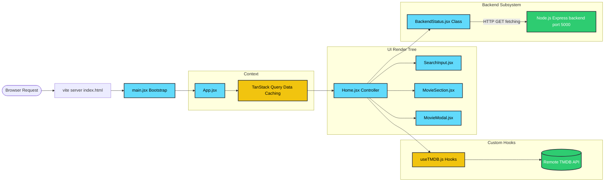

# React & Cine-Discover Workflow Diagrams

These visual workflow diagrams map out exactly how React operates internally, and how data physically moves through the specific Cine-Discover ecosystem.

## 1. Core React Internal Workflow (State & Virtual DOM)

This diagram visualizes how React efficiently processes user input and dynamically updates the browser DOM using its engine.

```mermaid
flowchart TD
    User([👤 User interaction e.g. typing]) --> StateChange[⚙️ State Changes via 'setQuery()']
    StateChange --> Render[💻 Component Function Re-runs]
    Render --> VirtualDOMOld[📄 Old Virtual DOM]
    Render --> VirtualDOMNew[📄 New Virtual DOM]
    VirtualDOMOld -. Diffing Engine (Reconciliation) .- VirtualDOMNew
    VirtualDOMNew --> DiffResult{🔍 Identify exact node changes}
    DiffResult --> Batch[⚡ Batch optimal DOM mutations]
    Batch --> RealDOM[🌐 Real Browser DOM Updated]
    RealDOM --> VisibleChange([👁️ User immediately sees new UI])

    classDef core fill:#61dafb,stroke:#333,stroke-width:2px,color:black
    class StateChange,Render core
```

## 2. Cine-Discover Ecosystem (Data Flow)

This maps the exact execution path of how data originates locally, mounts into the browser through Vite, and branches off into API requests.


